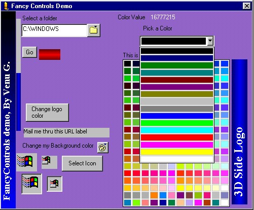



## FancyControls

### Description

An excellent set of ActiveX controls which are so unique that you'll start using them in your software instantly.
 
### More Info
 
Knowledge about using ActiveX controls.

             |
---                |---
**Submitted On**   |2000-07-25 18:10:58
**By**             |[Venu G\.](https://github.com/Planet-Source-Code/PSCIndex/blob/master/ByAuthor/venu-g.md)
**Level**          |Intermediate
**User Rating**    |4.0 (16 globes from 4 users)
**Compatibility**  |VB 5\.0, VB 6\.0, ASP \(Active Server Pages\) 
**Category**       |[OLE/ COM/ DCOM/ Active\-X](https://github.com/Planet-Source-Code/PSCIndex/blob/master/ByCategory/ole-com-dcom-active-x__1-29.md)
**World**          |[Visual Basic](https://github.com/Planet-Source-Code/PSCIndex/blob/master/ByWorld/visual-basic.md)
**Archive File**   |[CODE\_UPLOAD82027262000\.zip](https://github.com/Planet-Source-Code/venu-g-fancycontrols__1-10096/archive/master.zip)

